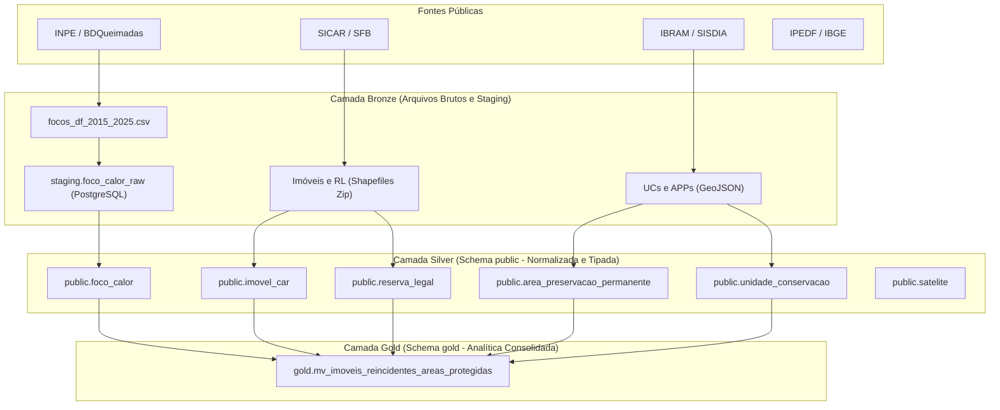

# Release Notes 1 - Banco de Dados 2

Nome do grupo: Grupo 5  
Integrantes:
- Cláudio Henrique dos Santos Carvalho (221007958)
- Elias Faria de Oliveira (221007706)
- Gabriel Fernando de Jesus Silva (222022162)
- Gabriel Marques de Souza (202016266)
- João Victor da Silva Batista de Farias (221022604)
- Manoel Felipe Teixeira Neto (211041240)
- Samuel Ribeiro da Costa (211031486)  
Data: 05/10/2026  
Domínio: Monitoramento geoespacial e ambiental de focos de calor, áreas públicas protegidas e imóveis rurais no Distrito Federal.

## 1. Domínio, perguntas e valor de negócio

Domínio de aplicação:
A plataforma Corta-Fogo DF realiza engenharia de dados territoriais voltada ao monitoramento, cruzamento espacial e análise histórica de focos de calor detectados por satélite no Distrito Federal. O sistema confronta as ocorrências térmicas da série de 2015 a 2025 com os perímetros cadastrais do Cadastro Ambiental Rural (SICAR) e com os limites regulatórios de Unidades de Conservação e Áreas de Preservação Permanente (IBRAM/SISDIA).

Perguntas que o projeto pretende responder:

1. Quais imóveis rurais do Distrito Federal tiveram focos de calor reincidentes em áreas de reserva legal, de preservação permanente ou a até 1 km de unidades de conservação entre 2015 e 2025? (Pergunta central da E1, respondida diretamente pela Camada Gold).
2. Qual a correlação entre a distribuição espacial dos focos de calor e os indicadores socioeconômicos (PIB per capita e renda domiciliar) das Regiões Administrativas do DF?
3. Quais Unidades de Conservação do Distrito Federal registraram a maior densidade de focos de calor em sua faixa de amortecimento de 1.000 metros ao longo da série histórica?

Valor de negócio dos dados gerados:
Os dados consolidados atendem aos analistas de fiscalização ambiental do IBRAM e aos planejadores de resposta do Corpo de Bombeiros Militar do Distrito Federal (CBMDF). A identificação prévia de imóveis com reincidência de queimadas em áreas ambientalmente frágeis apoia a priorização de vistorias de campo e a emissão de notificações antes do início do período crítico de estiagem (maio a setembro), otimizando o deslocamento de brigadas e reduzindo o tempo de resposta a incêndios florestais.

## 2. Fontes de dados

| Fonte | Link | Formato | Pergunta(s) que apoia |
| :--- | :--- | :--- | :--- |
| BDQueimadas (INPE) | [https://queimadas.dgi.inpe.br/queimadas/bdqueimadas](https://queimadas.dgi.inpe.br/queimadas/bdqueimadas) | CSV | P1, P2, P3 |
| SICAR (SFB / MAPA) | [https://www.car.gov.br/](https://www.car.gov.br/) | Shapefile (Zip) | P1 |
| SISDIA (IBRAM / Geoportal DF) | [https://sisdia.df.gov.br/](https://sisdia.df.gov.br/) | GeoJSON | P1, P3 |
| IPEDF / IBGE (Contas Regionais e PDAD) | [https://www.ipe.df.gov.br/](https://www.ipe.df.gov.br/) | Dados Abertos (CSV/Tabelas) | P2 |

## 3. Escolha do banco de dados

Banco escolhido: PostgreSQL 16 com extensão PostGIS 3.4.

Principais argumentos:

* Workload: cruzamentos espaciais métricos de alto custo computacional (Point-in-Polygon contra polígonos complexos de mais de 50 mil vértices e cálculo de vizinhança de 1.000 metros via `ST_DWithin`), combinados com agrupamentos e agregações temporais de 11 anos.
* Modelo de dados: estrutura híbrida relacional e espacial, preservando integridade referencial com chaves estrangeiras (`satelite`, `imovel_car`, `reserva_legal`), checagem topológica de consistência (`ST_IsValid(geom) AND NOT ST_IsEmpty(geom)`) e padronização cartográfica plana no fuso local (SIRGAS 2000 / UTM zone 23S, EPSG:31983).
* Volume, custo e operação: software livre e maduro, executado localmente via Docker sem custo de licença. Indexação espacial GiST (R-tree) que viabiliza consultas em subsegundo sobre o volume integral do DF (38.945 focos e 21.047 imóveis).
* Alternativas consideradas: PostgreSQL relacional puro descartado por inviabilidade do algoritmo Point-in-Polygon sem índice R-tree; MongoDB 7.0 descartado por ausência de join espacial nativo e suporte restrito a coordenadas esféricas WGS84, gerando timeout superior a 180 segundos no benchmark.

➡️ ADR completa: [ADR 0001 - Adotar PostgreSQL com PostGIS como banco principal](docs/adr/01-adotar-postgresql-com-postgis-camada-gold.md)

## 4. Pipeline de dados (versão inicial)

Diagrama:

Etapas:

| Etapa | O que faz | Ferramenta / script |
| :--- | :--- | :--- |
| Ingestão | Download automatizado dos registros do BDQueimadas e camadas espaciais do SISDIA/IBRAM, além da descompactação dos cadastros do SICAR. | `src/pipeline/extract_focos.py`, `src/pipeline/extract_camadas.py` |
| Armazenamento bruto | Armazenamento de arquivos no formato original das fontes e carga transitória de coordenadas pontuais. | `data/raw/`, `data/processed/`, tabela `staging.foco_calor_raw` |
| Transformação | Conversão cartográfica para EPSG:31983, saneamento topológico com correção de autointerseções e deduplicação de sensores orbitais. | `src/pipeline/load_camadas.py` (GeoPandas / Shapely) e SQL |
| Carga | Inserção com integridade referencial nas tabelas relacionais do schema `public` (Silver) e aplicação de migrações DDL versionadas. | Flyway (migrações `V1` a `V7`), `scripts/carga/carregar_focos.sql` |
| Consumo | Materialização pré-computada dos imóveis reincidentes na camada Gold para resposta imediata à pergunta de gestão e suporte a análises socioeconômicas. | `scripts/carga/refresh_gold.sql`, `gold.mv_imoveis_reincidentes_areas_protegidas` |

Status atual:
A versão R1 entrega a totalidade dos dados do Distrito Federal ingeridos e auditados no PostgreSQL 16 com PostGIS. As tabelas da camada Silver estão normalizadas com chaves primárias, estrangeiras e índices GiST. A camada Gold está estruturada em schema próprio com visão materializada que consolida os critérios da pergunta de gestão em consulta direta. A execução completa e reprodutível ocorre com o comando `docker compose up`. Para as entregas posteriores (E2 a E4), estão previstos o enriquecimento com dados de flora nativa ameaçada e estações fluviométricas, orquestração de cargas incrementais e disponibilização de camada analítica complementar em GeoParquet/DuckDB.
